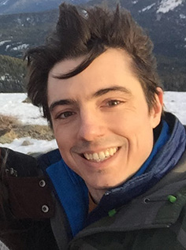

# About me #
I look like this:

## My background ##
I skipped (as in truancy) high school because I disliked the world. I would say my criticisms remain valid but my analysis of what to do about them has changed. I became a community college student, then an undergraduate at UC Berkeley. I double majored in physics and math, and I worked on probabilistic graphical models probing human assessments of causality. I also worked on large scale ecosystem modeling at Harvard (relevant to climate change), but I disliked the idea of reading papers about tree physiology and soil composition indefinitely. It was also very clear by that time that climate science was not the bottleneck restraining meaningful climate action. I'm currently working on a PhD on neural computation.

My primary goals in life are living up to my humanist values (foremost), having fun with friends and family (secondarily), and doing meaningful, interesting, reasonably remunerated work (a close third). I aim to live in the mountains of the Pacific Northwest with a certain scholar of English literature, cats, dogs, and a garden.

[Back to the index](../index)
